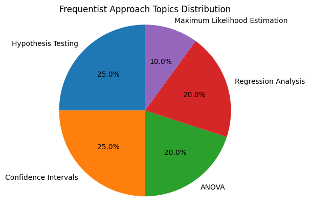

This repository contains materials about the frequentist approach(FA) before delving into Bayesian statistics. The provided files cover essential topics in FA.

## Files

1. **frequentist statistics-1.pdf && frequentist statistics-2.pdf**
   - **Contents**:
     - Introduction to Frequentist methods
     - Data Analysis (Using **ggplot** in R)
     - Probability distributions (PDFs, CDFs)
     - Continuous and discrete random variables
     - Hypothesis testing
     - Confidence intervals

## Requirements

- PDF reader to view the documents.

