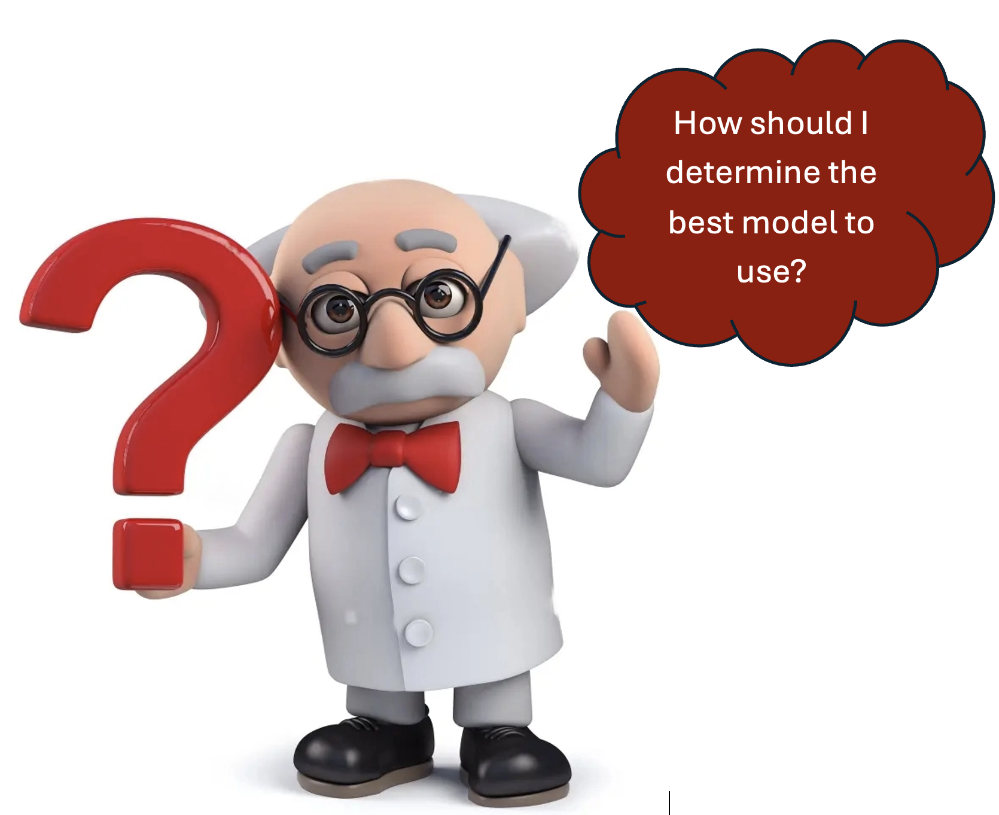

# Bayesian Statistics and Model Comparisons

This repository contains various techniques for selecting and comparing statistical models, especially within a Bayesian framework.

## Outline

### 1. Methods for Model Comparison
- **Bayes Factors (BF):** Gold standard for hypothesis testing in Bayesian statistics.
- **Stochastic Search Variable Selection (SSVS):** Bayesian method analogous to stepwise variable selection.
- **Cross-Validation (CV):** Common method for model validation and selection.
- **Information Criteria:**
  - **Akaike Information Criteria (AIC):**
  - **Bayesian Information Criteria (BIC):**
  - **Deviance Information Criteria (DIC):**
  - **Watanabe-Akaike Information Criteria (WAIC):**



### 2. Posterior Predictive Checks
- Evaluates model fit by comparing observed data to data simulated from the model.

## Key Concepts

### Bayes Factors (BF)
- Used to compare models by calculating the ratio of the posterior probabilities of the models.
- A high BF indicates strong evidence in favor of one model over another.

### Stochastic Search Variable Selection (SSVS)
- Places priors on all possible models using variable inclusion indicators.
- MCMC is used to approximate the posterior probabilities of each model.

### Cross-Validation (CV)
- Splits the data into K groups and iteratively trains and tests the model.
- Measures prediction accuracy to select the best model.

### Information Criteria
- **AIC:** Penalizes models based on the number of parameters to avoid overfitting.
- **BIC:** Similar to AIC but includes a stronger penalty for the number of parameters.
- **DIC:** Popular Bayesian alternative to AIC/BIC, taking into account the posterior distribution.
- **WAIC:** Approximation to leave-one-out CV, theoretically justified and often similar to DIC.

### Posterior Predictive Checks
- Uses the posterior predictive distribution to evaluate model fit.
- Bayesian p-value helps determine if the model fits the observed data well.

## Requirements
To view and run the examples provided, you will need:
- **PDF Reader:** To view the `Bayesian_computation.pdf` file.
- **R and RStudio:** To run the R code and view the `Bayesian_computation.Rmd` file.
- **Web Browser:** To view the `Bayesian_computation.html` file.
- **R Packages:**
  - `rjags:` For running MCMC methods.
  - `ggplot2:` For creating visualizations.
  - `tidyverse:` For data manipulation.
  - `ggforce:` For enhanced `ggplot` functionalities, including `facet_wrap_paginate`.

You can install the required R packages using the following commands:

```r
install.packages(c("rjags", "ggplot2", "tidyverse", "ggforce"))
