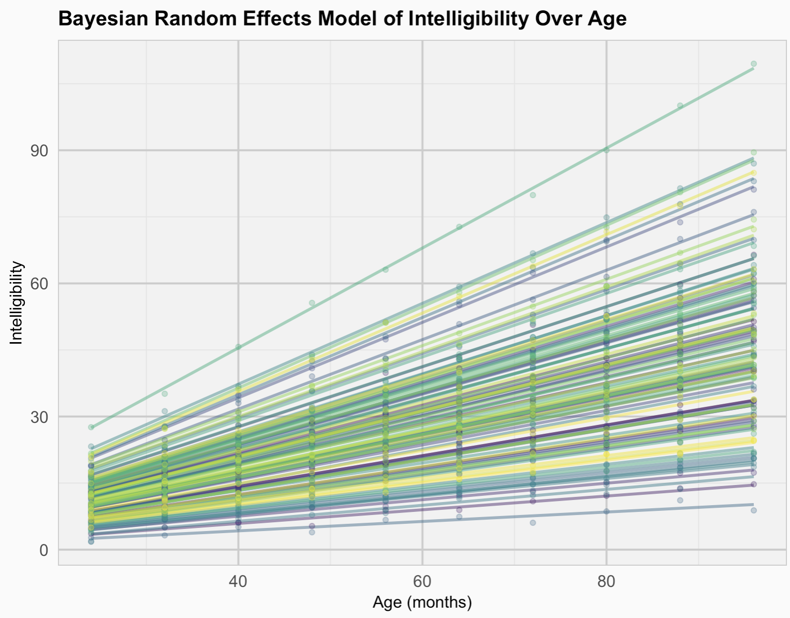

This repository contains various Bayesian statistical methods and models, implemented and explained with practical examples. I have taken the problems from Professor Brian Reich's book for graduate students, who taught me Applied Bayesian Statistics course. Thanks to him for making course so enjoyable and for inspiring us to delve deeper into the world of Bayesian statistics.

Below are the key topics covered:

- **Bayesian t-tests:** Implementing Bayesian alternatives to traditional t-tests.
- **Generalized Linear Models:** Extending linear models to handle different types of response variables.
- **Random Effects:** Modeling data with hierarchical structures using random effects.

<p align="center">
  
</p>


### Flexible Models
- **Non-linear Regression:** Implementing regression models for non-linear relationships.
- **Heteroskedastic Errors:** Dealing with non-constant variance in error terms.
- **Non-Gaussian Errors:** Handling errors that do not follow a Gaussian distribution.
- **Correlated Errors:** Addressing correlation within error terms.

### Bayesian Linear Regression
- **Gaussian Priors:** Utilizing Gaussian distributions as priors in Bayesian models.
- **Jeffreys' Priors:** Applying non-informative priors for objective Bayesian analysis.
- **Shrinkage Priors:** Enhancing model robustness with priors that induce shrinkage.


## Requirements

- **PDF Reader** 
- **R and RStudio** 
- **R Packages:** Install the necessary R packages with the following command:
  ```r
  install.packages(c("rjags", "ggplot2", "tidyverse", "ggforce"))
